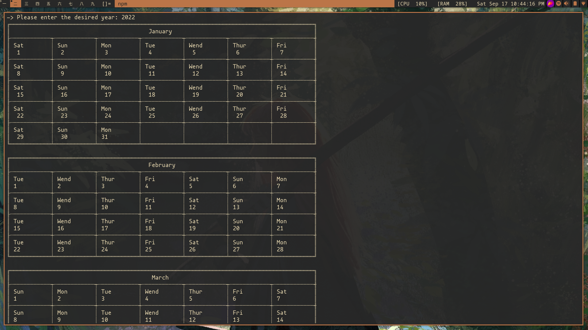

# Desafio de Construção de Calendário - IESB Estrutura de Dados

## Instruções:

Escrever um programa que imprima um calendário no terminal.

## Solução:

Foi implementado um programa que recebe um input do ano que se deseja ver o calendário.
Em seguida um calendário é impresso na forma de tabelas com os dias do mês e da semana, considerando anos bissextos.

| Arquivo | Funcao |
|---------|--------|
|Index.ts         | Ponto de entrada da aplicação        |
|month.enum.ts         | Contém dois enums, um com relação a quantidade de dias em um mês e a outra o nome do mês        |
|month.interface.ts         | Define a interface dos mêses, contando com dois campos obrigatórios e três opcionais       |
|weekdays.ts         | Define as funções para testar se é ano bissexto e para determinar o dia da semana através do ano       |
|cyclic.ts         | Define uma lista ligada circular de dias, a qual é usada nos mêses para determinar o dia da semana |
|months.ts         | Define uma classe para cada mês |
|calendar.ts         | Uma classe abstrata com um único método estático que imprime todos os meses de um determinado ano|

## Bibliotecas utilizadas:

- prompt-sync para leitura de input do usuário 

- gajus/table para a geração de strings de tabelas 

## Instalando  e rodando a aplicação

Instale as dependências com o comando 

```
$ npm install
```

Execute a aplicação com o comando

```
$ npm run dev
```

## Programa em Execução



